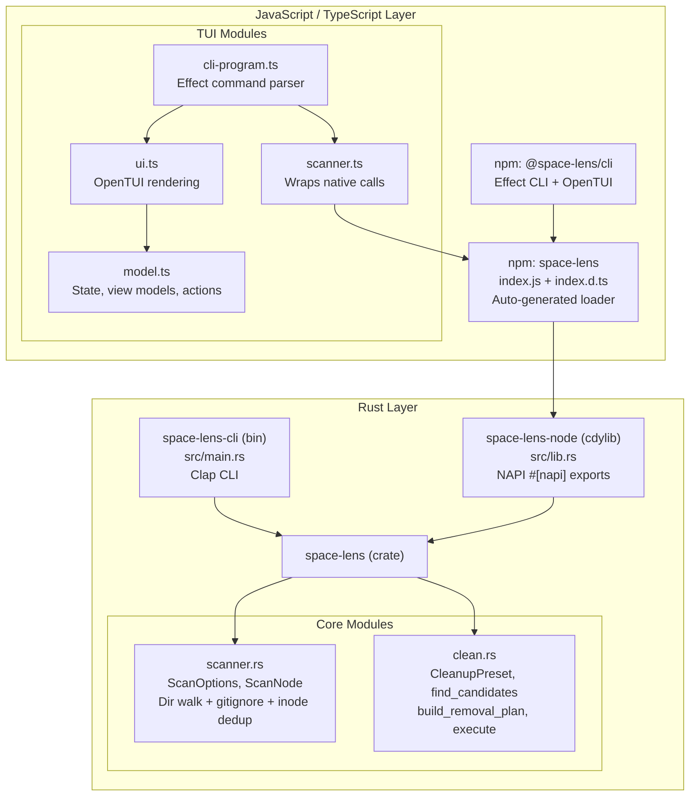
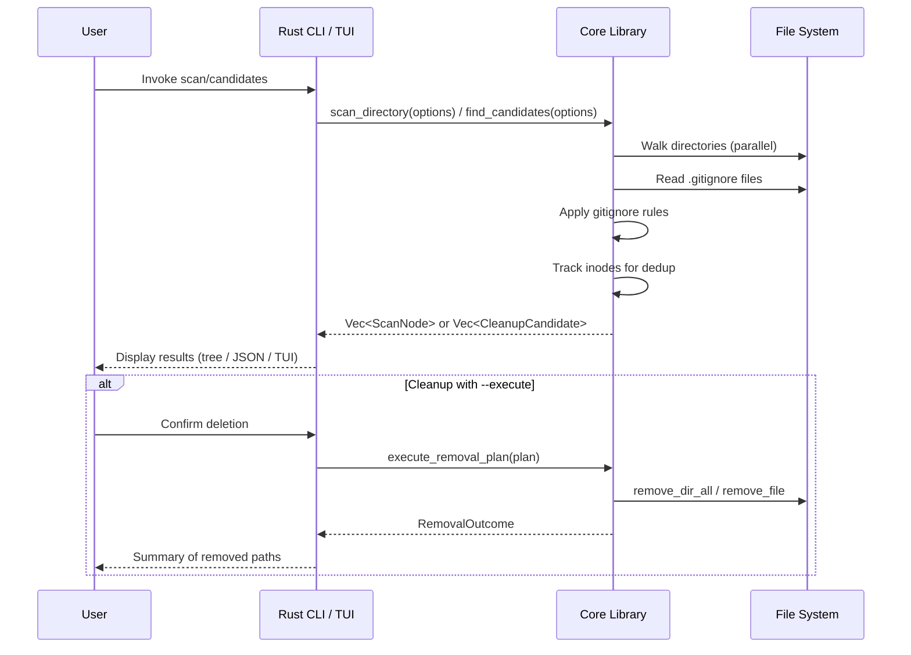

# Architecture Overview

<cite>
**Referenced Files in This Document**
- [packages/space-lens/src/lib.rs](file:///Users/hk/Dev/space-lens/packages/space-lens/src/lib.rs)
- [packages/space-lens/src/scanner.rs](file:///Users/hk/Dev/space-lens/packages/space-lens/src/scanner.rs)
- [packages/space-lens/src/clean.rs](file:///Users/hk/Dev/space-lens/packages/space-lens/src/clean.rs)
- [packages/node/src/lib.rs](file:///Users/hk/Dev/space-lens/packages/node/src/lib.rs)
- [apps/cli/src/main.rs](file:///Users/hk/Dev/space-lens/apps/cli/src/main.rs)
- [apps/tui/src/scanner.ts](file:///Users/hk/Dev/space-lens/apps/tui/src/scanner.ts)
- [apps/tui/src/cli-program.ts](file:///Users/hk/Dev/space-lens/apps/tui/src/cli-program.ts)
- [apps/tui/src/ui.ts](file:///Users/hk/Dev/space-lens/apps/tui/src/ui.ts)
- [apps/tui/src/model.ts](file:///Users/hk/Dev/space-lens/apps/tui/src/model.ts)
- [apps/tui/src/runtime.ts](file:///Users/hk/Dev/space-lens/apps/tui/src/runtime.ts)
</cite>

## Table of Contents

1. [System Architecture](#system-architecture)
2. [Code Organization by Layer](#code-organization-by-layer)
3. [Data Flow](#data-flow)
4. [Cross-Cutting Concerns](#cross-cutting-concerns)

## System Architecture

**Diagram sources**

- [packages/space-lens/src/lib.rs](file:///Users/hk/Dev/space-lens/packages/space-lens/src/lib.rs#L1-L10)
- [apps/tui/src/cli-program.ts](file:///Users/hk/Dev/space-lens/apps/tui/src/cli-program.ts#L1-L92)

## Code Organization by Layer

### Layer 1: Rust Core Library (`packages/space-lens/`)

The foundational crate. Two public modules:

- **scanner** (`scanner.rs`): Directory tree scanning with gitignore-aware filtering, parallel traversal (rayon), hard link deduplication via inode tracking, and configurable ignored-mode handling.
- **clean** (`clean.rs`): Cleanup candidate discovery by preset rules, removal plan building, and execution.

Public API surface (`lib.rs`): `scan_directory`, `find_candidates`, `build_removal_plan`, `execute_removal_plan`, `measure_path`.

### Layer 2: NAPI Bindings (`packages/node/`)

A `cdylib` crate that re-exports the core library's functionality through napi-rs `#[napi]` attributes. Converts Rust types to JS-compatible `#[napi(object)]` structs (u64 → i64, PathBuf → String, etc.). Auto-generates `index.js` (loader for the correct platform binary) and `index.d.ts` (TypeScript declarations).

### Layer 3: Rust CLI (`apps/cli/`)

A binary crate using clap with three subcommands: `scan`, `candidates`, `clean`. Links directly to `space-lens` as a workspace dependency. Uses serde_json for JSON output mode.

### Layer 4: TypeScript TUI (`apps/tui/`)

An npm package that consumes the `space-lens` npm package. Uses Effect CLI for argument parsing and OpenTUI for terminal rendering. Must run under Bun.

**Section sources**

- [packages/space-lens/src/lib.rs](file:///Users/hk/Dev/space-lens/packages/space-lens/src/lib.rs#L6-L9)
- [packages/node/src/lib.rs](file:///Users/hk/Dev/space-lens/packages/node/src/lib.rs#L54-L71)
- [apps/cli/src/main.rs](file:///Users/hk/Dev/space-lens/apps/cli/src/main.rs#L82-L89)

## Data Flow

The `clean` command always starts with a dry-run. Only explicit `--execute` (Rust CLI) or `executeCleanup()` (JS API) causes actual file deletion.

**Section sources**

- [packages/space-lens/src/clean.rs](file:///Users/hk/Dev/space-lens/packages/space-lens/src/clean.rs#L100-L117)
- [packages/space-lens/src/clean.rs](file:///Users/hk/Dev/space-lens/packages/space-lens/src/clean.rs#L119-L135)
- [apps/cli/src/main.rs](file:///Users/hk/Dev/space-lens/apps/cli/src/main.rs#L136-L165)

## Cross-Cutting Concerns

### Platform Support

The scanner has platform-specific inode detection:
- **Unix**: Uses `std::os::unix::fs::MetadataExt` to get `ino()` and `dev()`.
- **Windows**: Uses `GetFileInformationByHandle` to get file index and volume serial number.
- **Other platforms**: Inode dedup is skipped (no hard link dedup).

Allocated size calculation also differs:
- **Unix**: Uses `metadata.blocks()` × 512 (accounts for block allocation, sparse files).
- **Other platforms**: Uses `metadata.len()` (logical file size).

### Preset System

Three cleanup presets are built-in. When no presets specified, all three are used:
| Preset | Target | Matches By |
|--------|--------|-----------|
| `node` | `node_modules/` | Directory name traversal |
| `rust` | `target/` | Directory name traversal |
| `gitignored` | Any path matched by `.gitignore` | Reuses scanner with Summarize mode |

### Dry-Run Safety

- `build_removal_plan` merely collects candidates into a plan with total size.
- `execute_removal_plan` performs actual deletion and returns a `RemovalOutcome`.
- The JS API splits this into `planCleanup()` and `executeCleanup()`.
- The Rust CLI uses `--execute` to opt in.

**Section sources**

- [packages/space-lens/src/scanner.rs](file:///Users/hk/Dev/space-lens/packages/space-lens/src/scanner.rs#L248-L294)
- [packages/space-lens/src/clean.rs](file:///Users/hk/Dev/space-lens/packages/space-lens/src/clean.rs#L66-L98)
- [packages/space-lens/src/clean.rs](file:///Users/hk/Dev/space-lens/packages/space-lens/src/clean.rs#L100-L117)
