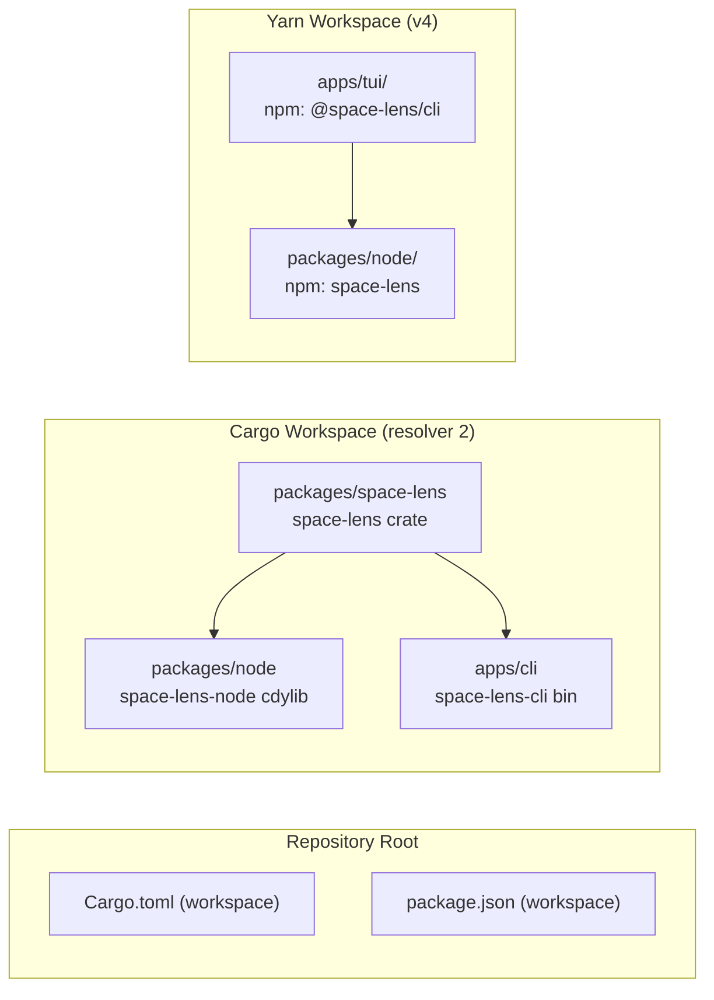
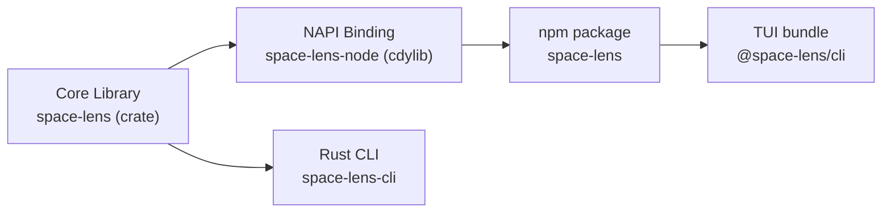

# Monorepo Architecture

<cite>
**Referenced Files in This Document**
- [Cargo.toml](file:///Users/hk/Dev/space-lens/Cargo.toml)
- [package.json](file:///Users/hk/Dev/space-lens/package.json)
- [.yarnrc.yml](file:///Users/hk/Dev/space-lens/.yarnrc.yml)
- [yarn.lock](file:///Users/hk/Dev/space-lens/yarn.lock)
- [packages/space-lens/Cargo.toml](file:///Users/hk/Dev/space-lens/packages/space-lens/Cargo.toml)
- [packages/node/Cargo.toml](file:///Users/hk/Dev/space-lens/packages/node/Cargo.toml)
- [apps/cli/Cargo.toml](file:///Users/hk/Dev/space-lens/apps/cli/Cargo.toml)
- [packages/node/package.json](file:///Users/hk/Dev/space-lens/packages/node/package.json)
- [apps/tui/package.json](file:///Users/hk/Dev/space-lens/apps/tui/package.json)
</cite>

## Table of Contents

1. [Two Workspaces, One Repo](#two-workspaces-one-repo)
2. [Dependency Graph](#dependency-graph)
3. [Build Order](#build-order)
4. [Published Packages](#published-packages)

## Two Workspaces, One Repo

Space Lens uses **two independent workspace systems** sharing the same repository root:



The two workspaces are orthogonal — `packages/node/` participates in both (Cargo crate `space-lens-node` + npm package `space-lens`). The Cargo workspace handles the Rust compilation graph; the Yarn workspace handles npm dependency resolution and publishing.

**Section sources**

- [Cargo.toml](file:///Users/hk/Dev/space-lens/Cargo.toml#L1-L14)
- [package.json](file:///Users/hk/Dev/space-lens/package.json#L1-L42)

## Dependency Graph

### Cargo Workspace Dependencies

| Crate | Location | Dependencies |
|-------|----------|-------------|
| `space-lens` | `packages/space-lens/` | `ignore`, `rayon`, `serde`, `windows-sys` |
| `space-lens-node` | `packages/node/` | `napi`, `napi-derive`, `space-lens` (path), `napi-build` (build) |
| `space-lens-cli` | `apps/cli/` | `anyhow`, `clap`, `serde`, `serde_json`, `space-lens` (path) |

### Yarn Workspace Dependencies

| Package | Location | Dependencies |
|---------|----------|-------------|
| `space-lens` | `packages/node/` | (native binary; no JS deps) |
| `@space-lens/cli` | `apps/tui/` | `@effect/cli`, `@effect/platform`, `@effect/platform-node`, `@effect/printer`, `@effect/printer-ansi`, `@effect/typeclass`, `@opentui/core`, `effect`, `space-lens`, `web-tree-sitter` |

**Diagram sources**

- [packages/space-lens/Cargo.toml](file:///Users/hk/Dev/space-lens/packages/space-lens/Cargo.toml#L10-L17)
- [packages/node/Cargo.toml](file:///Users/hk/Dev/space-lens/packages/node/Cargo.toml#L13-L19)
- [apps/cli/Cargo.toml](file:///Users/hk/Dev/space-lens/apps/cli/Cargo.toml#L14-L19)
- [apps/tui/package.json](file:///Users/hk/Dev/space-lens/apps/tui/package.json#L36-L53)

## Build Order

Because both Cargo and Yarn workspaces share `packages/node/`, the NAPI binding must be built first before JS packages that depend on it:



Development workflow:
```
1. cargo build -p space-lens          # Core library (Rust)
2. yarn build:debug                   # NAPI binding (debug)
3. yarn workspace @space-lens/cli build  # TUI bundle
```

Testing depends on step 2 being done first — the native `.node` binary must exist.

**Section sources**

- [packages/node/package.json](file:///Users/hk/Dev/space-lens/packages/node/package.json#L52-L53)
- [apps/tui/package.json](file:///Users/hk/Dev/space-lens/apps/tui/package.json#L30)

## Published Packages

### `space-lens` (npm)

- Published from `packages/node/` directory.
- CI publishes with npm provenance on version tags.
- Prebuilt binaries for 8 targets (x86_64 + aarch64 × Windows/macOS/Linux × gnu/musl).
- The `index.js` loader detects platform and loads the correct `.node` binary.

### `@space-lens/cli` (npm)

- Published from `apps/tui/` directory.
- Separate CI workflow (`npm-cli.yml`) triggered by `v*` or `cli-v*` tags, or manual dispatch.
- Published as an ESM bundle built by tsdown.
- Requires Bun at runtime; Node.js users get an error message.

**Section sources**

- [.github/workflows/CI.yml](file:///Users/hk/Dev/space-lens/.github/workflows/CI.yml#L256-L308)
- [.github/workflows/npm-cli.yml](file:///Users/hk/Dev/space-lens/.github/workflows/npm-cli.yml#L1-L78)
- [packages/node/index.js](file:///Users/hk/Dev/space-lens/packages/node/index.js#L1-L30)
