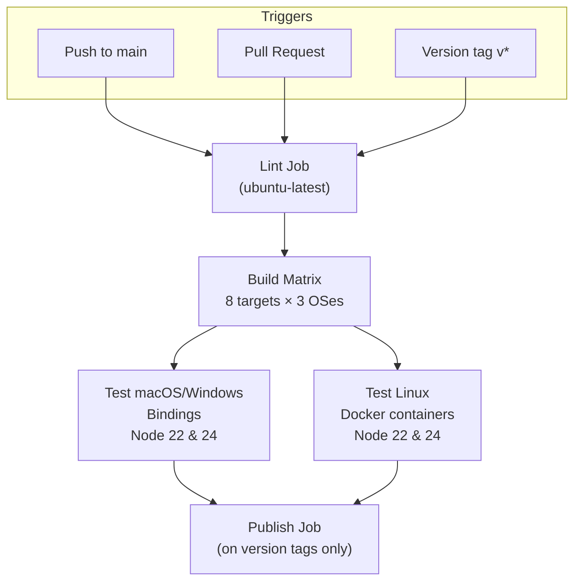
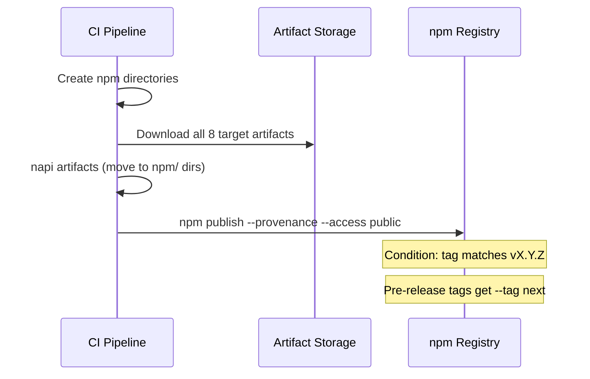

# CI and Deployment

<cite>
**Referenced Files in This Document**
- [.github/workflows/CI.yml](file:///Users/hk/Dev/space-lens/.github/workflows/CI.yml)
- [.github/workflows/npm-cli.yml](file:///Users/hk/Dev/space-lens/.github/workflows/npm-cli.yml)
- [.github/renovate.json](file:///Users/hk/Dev/space-lens/.github/renovate.json)
- [package.json](file:///Users/hk/Dev/space-lens/package.json)
</cite>

## Table of Contents

1. [CI Workflow](#ci-workflow)
2. [Publish Workflow (space-lens)](#publish-workflow-space-lens)
3. [Publish Workflow (@space-lens/cli)](#publish-workflow-spacelenscli)
4. [Build Matrix Strategy](#build-matrix-strategy)
5. [Dependency Automation](#dependency-automation)

## CI Workflow

The main CI workflow (`.github/workflows/CI.yml`) runs on pushes to `main` and pull requests (excluding docs, markdown, and config-only changes).

### Lint Job

Single runner on `ubuntu-latest`:
1. Checkout repository
2. Setup Node 24 + Corepack
3. Setup Rust stable with clippy + rustfmt
4. `yarn install`
5. `yarn lint` (oxlint + tsc --noEmit)
6. `yarn typecheck`
7. `cargo fmt --all -- --check`
8. `cargo clippy --workspace --all-targets`
9. `cargo test --workspace`
10. `yarn workspace space-lens test && yarn workspace @space-lens/cli test`

**Section sources**

- [.github/workflows/CI.yml](file:///Users/hk/Dev/space-lens/.github/workflows/CI.yml#L23-L54)

## Publish Workflow (space-lens)

The publish job runs only on version tags (`v*`) after all build and test jobs pass.

- Uses **npm provenance** for package signing.
- Supports pre-release tags (`vX.Y.Z-something`) with `--tag next`.
- Skips if version is already published.

**Section sources**

- [.github/workflows/CI.yml](file:///Users/hk/Dev/space-lens/.github/workflows/CI.yml#L256-L308)

## Publish Workflow (@space-lens/cli)

A separate workflow (`.github/workflows/npm-cli.yml`) handles the TUI package publishing:

**Triggers:**
- Manual dispatch via GitHub UI (with `latest` or `next` dist-tag selection)
- Pushes to tags matching `v*` or `cli-v*`

**Steps:**
1. Checkout + setup Node 24
2. `yarn install --immutable`
3. `yarn workspace @space-lens/cli test`
4. `yarn workspace @space-lens/cli typecheck`
5. `yarn workspace @space-lens/cli build` (tsdown bundle)
6. `npm pack --dry-run` (verify package contents)
7. `npm publish --provenance --access public`

Tag resolution: `cli-vX.Y.Z` → `latest`; `cli-vX.Y.Z-beta` → `next`.

**Section sources**

- [.github/workflows/npm-cli.yml](file:///Users/hk/Dev/space-lens/.github/workflows/npm-cli.yml#L1-L78)

## Build Matrix Strategy

The build matrix covers 8 native targets:

| Host | Target | Cross-compilation |
|------|--------|-------------------|
| macOS | `x86_64-apple-darwin` | — |
| macOS | `aarch64-apple-darwin` | — |
| Windows | `x86_64-pc-windows-msvc` | — |
| Windows | `aarch64-pc-windows-msvc` | — |
| Ubuntu | `x86_64-unknown-linux-gnu` | napi-cross |
| Ubuntu | `x86_64-unknown-linux-musl` | cargo-zigbuild |
| Ubuntu | `aarch64-unknown-linux-gnu` | napi-cross |
| Ubuntu | `aarch64-unknown-linux-musl` | cargo-zigbuild |

Key infrastructure:
- musl targets use `mlugg/setup-zig` and `taiki-e/install-action` for `cargo-zigbuild`.
- Linux bindings are tested inside Docker containers (alpine for musl, slim for gnu).
- ARM Linux targets (aarch64) use native ARM GitHub runners.
- armv7 uses QEMU for emulation.

**Section sources**

- [.github/workflows/CI.yml](file:///Users/hk/Dev/space-lens/.github/workflows/CI.yml#L55-L137)

## Dependency Automation

Renovate bot (`renovate.json`) runs with:
- `:preserveSemverRanges` — does not pin ranges, keeps `^` as-is.
- `:disablePeerDependencies` — skips peer dep updates.
- `group:allNonMajor` — groups all non-major updates into single PRs.
- Commit prefix: `chore: bump up <package> version`.
- Labels: `dependencies`.
- napi-rs group label: `napi-rs`.

**Section sources**

- [.github/renovate.json](file:///Users/hk/Dev/space-lens/.github/renovate.json#L1-L20)
