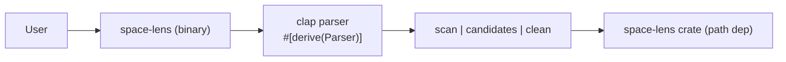

# Rust CLI

<cite>
**Referenced Files in This Document**
- [apps/cli/src/main.rs](file:///Users/hk/Dev/space-lens/apps/cli/src/main.rs)
- [apps/cli/Cargo.toml](file:///Users/hk/Dev/space-lens/apps/cli/Cargo.toml)
</cite>

## Table of Contents

1. [Overview](#overview)
2. [Commands](#commands)
3. [Output Formats](#output-formats)
4. [Error Handling](#error-handling)

## Overview

The Rust CLI (`apps/cli/`) is a binary crate called `space-lens-cli` that produces the `space-lens` binary. It uses clap with derive macros for argument parsing and links directly to the core library as a Cargo workspace dependency.



**Section sources**

- [apps/cli/src/main.rs](file:///Users/hk/Dev/space-lens/apps/cli/src/main.rs#L1-L8)
- [apps/cli/Cargo.toml](file:///Users/hk/Dev/space-lens/apps/cli/Cargo.toml#L1-L19)

## Commands

### `scan`

Scan directories and display a disk usage tree.

| Flag | Type | Default | Description |
|------|------|---------|-------------|
| `PATH` (positional) | `Vec<PathBuf>` | `.` | Directories to scan |
| `--json` | bool | false | Output as JSON |
| `--ignore-hidden` | bool | false | Skip hidden files |
| `--full-path` | bool | false | Show full paths instead of names |
| `--respect-gitignore` | bool | true | Apply `.gitignore` rules |
| `--ignored-mode` | enum | `summarize` | `summarize` or `exclude` |

```bash
cargo run -p space-lens-cli -- scan ~/Dev --json
cargo run -p space-lens-cli -- scan ~/Dev --ignore-hidden --full-path
```

### `candidates`

Find cleanup candidates matching presets.

| Flag | Type | Default | Description |
|------|------|---------|-------------|
| `PATH` (positional) | `Vec<PathBuf>` | `.` | Directories to search |
| `--preset` | enum (repeatable) | — | `node`, `rust`, `gitignored` |
| `--json` | bool | false | Output as JSON |
| `--ignore-hidden` | bool | false | Skip hidden paths |

```bash
cargo run -p space-lens-cli -- candidates ~/Dev --preset node --preset rust
cargo run -p space-lens-cli -- candidates ~/Dev --preset gitignored --json
```

### `clean`

Build a removal plan and optionally execute it.

| Flag | Type | Default | Description |
|------|------|---------|-------------|
| `PATH` (positional) | `Vec<PathBuf>` | `.` | Directories to search |
| `--preset` | enum (repeatable) | — | `node`, `rust`, `gitignored` |
| `--json` | bool | false | Output as JSON |
| `--ignore-hidden` | bool | false | Skip hidden paths |
| `--execute` | bool | false | Actually delete (dry-run without this) |

```bash
cargo run -p space-lens-cli -- clean ~/Dev --preset node          # dry-run
cargo run -p space-lens-cli -- clean ~/Dev --preset node --execute # delete
```

**Section sources**

- [apps/cli/src/main.rs](file:///Users/hk/Dev/space-lens/apps/cli/src/main.rs#L9-L68)
- [apps/cli/src/main.rs](file:///Users/hk/Dev/space-lens/apps/cli/src/main.rs#L92-L165)

## Output Formats

### Default (Tabular)

The default output for `candidates` and `clean` uses tab-separated columns:

```
size    preset   path              reason
1.5 MiB (1572864 bytes)  rust     /repo/target    Cargo build output directory
1.0 MiB (1048576 bytes)  node     /repo/node_modules   Node dependency directory
```

The `scan` command prints an indented tree:

```
repo  2.5 MiB (2621440 bytes)
  src    512 B
  target    2.0 MiB (2097152 bytes)
  node_modules    512 B
```

### JSON Mode

With `--json`, all commands output pretty-printed JSON via `serde_json::to_writer_pretty`.

**Section sources**

- [apps/cli/src/main.rs](file:///Users/hk/Dev/space-lens/apps/cli/src/main.rs#L167-L213)

## Error Handling

- Errors during file system access (permission denied, broken symlinks) are silently skipped during scanning — these entries are omitted from results.
- Errors during deletion are collected in `RemovalOutcome.errors` and printed to stderr.
- The program continues past individual errors rather than aborting.

**Section sources**

- [apps/cli/src/main.rs](file:///Users/hk/Dev/space-lens/apps/cli/src/main.rs#L144-L155)
