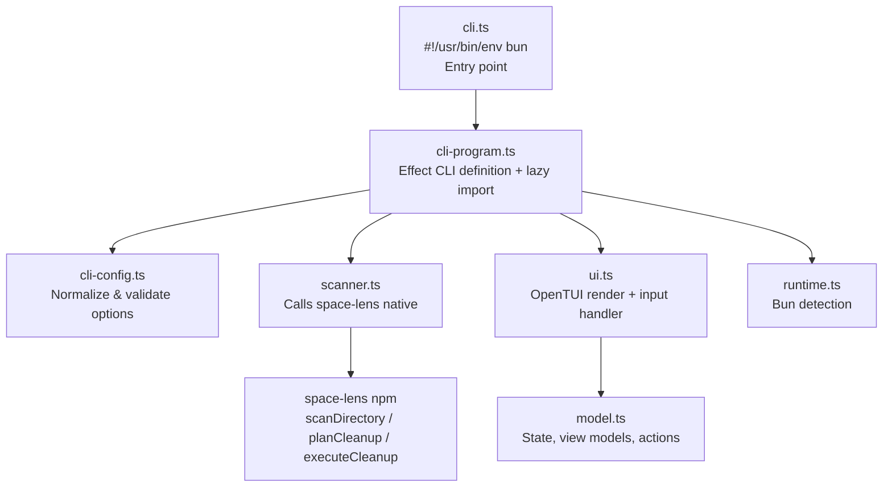
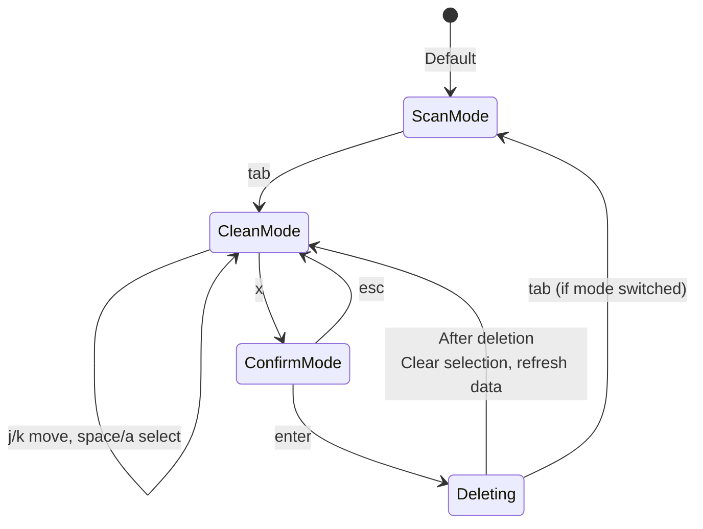

# TUI Application

<cite>
**Referenced Files in This Document**
- [apps/tui/src/cli.ts](file:///Users/hk/Dev/space-lens/apps/tui/src/cli.ts)
- [apps/tui/src/cli-program.ts](file:///Users/hk/Dev/space-lens/apps/tui/src/cli-program.ts)
- [apps/tui/src/cli-config.ts](file:///Users/hk/Dev/space-lens/apps/tui/src/cli-config.ts)
- [apps/tui/src/model.ts](file:///Users/hk/Dev/space-lens/apps/tui/src/model.ts)
- [apps/tui/src/ui.ts](file:///Users/hk/Dev/space-lens/apps/tui/src/ui.ts)
- [apps/tui/src/scanner.ts](file:///Users/hk/Dev/space-lens/apps/tui/src/scanner.ts)
- [apps/tui/src/runtime.ts](file:///Users/hk/Dev/space-lens/apps/tui/src/runtime.ts)
- [apps/tui/tsconfig.json](file:///Users/hk/Dev/space-lens/apps/tui/tsconfig.json)
- [apps/tui/tsdown.config.ts](file:///Users/hk/Dev/space-lens/apps/tui/tsdown.config.ts)
- [apps/tui/package.json](file:///Users/hk/Dev/space-lens/apps/tui/package.json)
</cite>

## Table of Contents

1. [Overview](#overview)
2. [Architecture](#architecture)
3. [Effect CLI Parser](#effect-cli-parser)
4. [TUI State Model](#tui-state-model)
5. [OpenTUI Rendering](#opentui-rendering)
6. [Keyboard Controls](#keyboard-controls)
7. [Runtime Requirement](#runtime-requirement)
8. [Deletion Flow](#deletion-flow)

## Overview

The TUI application (`apps/tui/`) is published as `@space-lens/cli` on npm. It provides a visual terminal interface for scanning disk usage and managing cleanup operations, built with OpenTUI and the Effect ecosystem.

```bash
yarn tui ~/Dev --preset rust
npx @space-lens/cli ~/Dev --preset node
```

**Section sources**

- [apps/tui/src/cli.ts](file:///Users/hk/Dev/space-lens/apps/tui/src/cli.ts#L1-L4)

## Architecture



The application uses **lazy dynamic imports**: the `scanner.ts` and `ui.ts` modules are imported only after CLI argument parsing succeeds. This keeps the startup fast and avoids loading OpenTUI (which requires Bun) for non-TUI operations.

**Section sources**

- [apps/tui/src/cli-program.ts](file:///Users/hk/Dev/space-lens/apps/tui/src/cli-program.ts#L60-L63)

## Effect CLI Parser

The CLI is defined using `@effect/cli`:

| Option | Flag | Type | Default | Description |
|--------|------|------|---------|-------------|
| paths | positional | `string[]` | — | Directories to scan |
| `--preset` / `-p` | repeated | `string[]` | — | `node`, `rust`, `gitignored` |
| `--ignore-hidden` | flag | `boolean` | false | Skip hidden paths |
| `--sort` | choice | `"size" \| "path"` | `"size"` | Sort cleanup candidates |

Configuration normalization in `cli-config.ts`:
- Empty paths default to `["."]` (current directory)
- Comma-separated presets are split (`"node,rust"` → `["node", "rust"]`)
- Invalid preset values throw an error via `parsePresetList`
- Invalid sort modes throw via `parseSortMode`

**Section sources**

- [apps/tui/src/cli-program.ts](file:///Users/hk/Dev/space-lens/apps/tui/src/cli-program.ts#L12-L27)
- [apps/tui/src/cli-config.ts](file:///Users/hk/Dev/space-lens/apps/tui/src/cli-config.ts)

## TUI State Model

The TUI state is managed by a pure, immutable-data model in `model.ts`:

```
TuiState {
  mode: 'scan' | 'clean'      # Active pane
  scanCursor: number           # Cursor position in scan tree
  cleanCursor: number          # Cursor position in clean list
  selectedPaths: Set<string>   # Paths selected for deletion
  confirmExecute: boolean      # Awaiting enter confirmation
  status: string               # Status message
}
```

Actions are dispatched through `applyTuiAction(state, action)`:

| Action | Effect |
|--------|--------|
| `{ type: 'switch-mode' }` | Toggle between scan/clean panes |
| `{ type: 'move', delta, rowCount }` | Move cursor up/down |
| `{ type: 'toggle-selected', path }` | Select/deselect a cleanup candidate |
| `{ type: 'toggle-all', paths }` | Select/deselect all visible candidates |
| `{ type: 'request-execute' }` | Enter confirmation mode |
| `{ type: 'cancel-execute' }` | Exit confirmation mode |
| `{ type: 'set-status', status }` | Update status line |
| `{ type: 'clear-selection' }` | Deselect all and reset confirmation |

View models (`createScanViewModel`, `createCleanViewModel`) derive display data from state + native data. They are recomputed on every render.

**Section sources**

- [apps/tui/src/model.ts](file:///Users/hk/Dev/space-lens/apps/tui/src/model.ts#L69-L97)
- [apps/tui/src/model.ts](file:///Users/hk/Dev/space-lens/apps/tui/src/model.ts#L99-Z00)

## OpenTUI Rendering

The UI uses OpenTUI's `createCliRenderer` with:
- **Alternate screen mode**: The terminal is cleared and restored on exit.
- **Exit on Ctrl+C**: Mapped to an input handler returning `false`.
- **Box layout**: Flex column with header, status, scroll panes, and error lines.

### Scan Pane

Shows an indented directory tree with size labels. Ignored/collapsed nodes are marked `[ignored] [collapsed]` in amber. Active row is highlighted in blue.

### Clean Pane

Shows cleanup candidates in a scrollable list with selection checkboxes (`[x]`/`[ ]`), color-coded by preset (green for node, red for rust, amber for gitignored). Border turns red during confirmation mode.

**Section sources**

- [apps/tui/src/ui.ts](file:///Users/hk/Dev/space-lens/apps/tui/src/ui.ts#L22-L76)
- [apps/tui/src/ui.ts](file:///Users/hk/Dev/space-lens/apps/tui/src/ui.ts#L199-L297)

## Keyboard Controls

| Key | Action |
|-----|--------|
| `tab` | Switch scan/clean mode |
| `j` / `↓` | Move cursor down |
| `k` / `↑` | Move cursor up |
| `space` | Toggle selection on active candidate |
| `a` | Select/unselect all visible candidates |
| `x` | Request deletion of selected paths |
| `enter` | Confirm deletion (after `x`) |
| `esc` | Cancel deletion confirmation |
| `q` / `Ctrl+C` | Quit |

**Section sources**

- [apps/tui/src/ui.ts](file:///Users/hk/Dev/space-lens/apps/tui/src/ui.ts#L147-L187)

## Runtime Requirement

OpenTUI 0.4.x uses native FFI interfaces that are currently only available in Bun. The application checks for Bun at startup:

```typescript
export function assertSupportedRuntime(): void {
  if (!globalThis.Bun) {
    throw new Error('OpenTUI currently requires Bun. Run this CLI with `bun` or `yarn tui`.')
  }
}
```

Running `spacelens` with Node.js will print this error message and exit.

**Section sources**

- [apps/tui/src/runtime.ts](file:///Users/hk/Dev/space-lens/apps/tui/src/runtime.ts#L1-L13)
- [apps/tui/src/cli-program.ts](file:///Users/hk/Dev/space-lens/apps/tui/src/cli-program.ts#L56-L57)

## Deletion Flow



The deletion confirmation is a two-step process: press `x` to enter confirmation mode (the clean pane border turns red), then `enter` to execute. This prevents accidental deletions.
