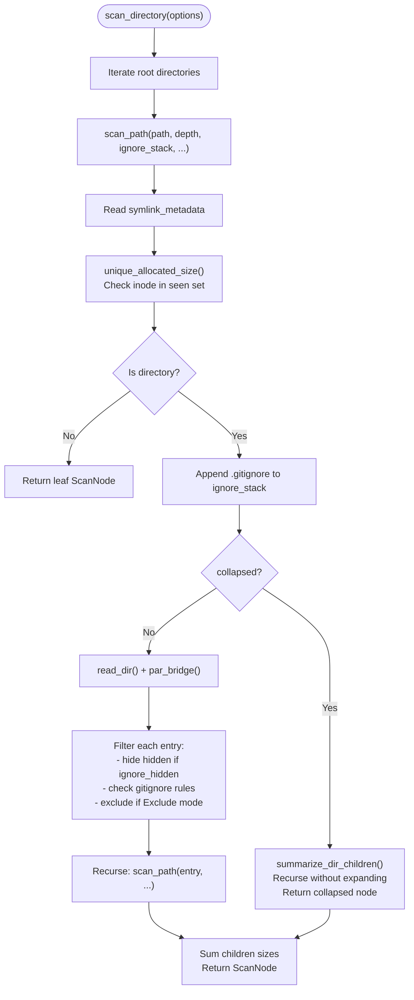
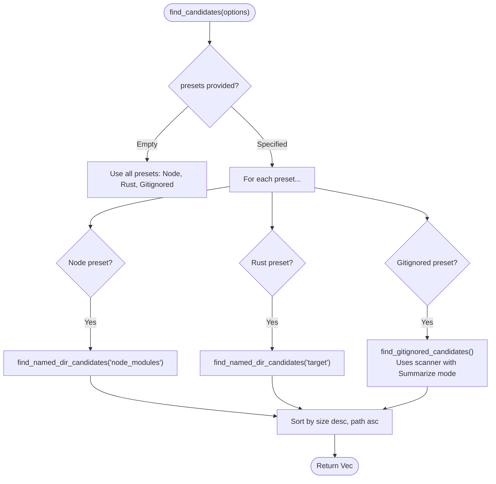
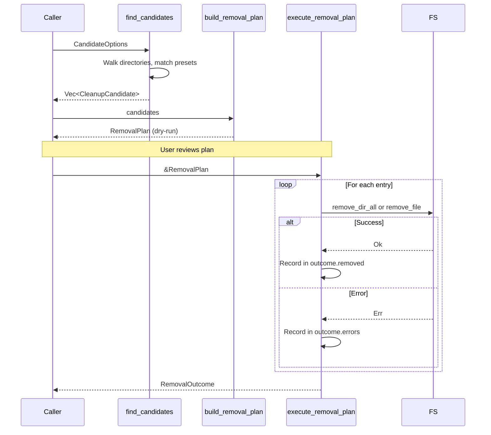

# Core Library

<cite>
**Referenced Files in This Document**
- [packages/space-lens/src/lib.rs](file:///Users/hk/Dev/space-lens/packages/space-lens/src/lib.rs)
- [packages/space-lens/src/scanner.rs](file:///Users/hk/Dev/space-lens/packages/space-lens/src/scanner.rs)
- [packages/space-lens/src/clean.rs](file:///Users/hk/Dev/space-lens/packages/space-lens/src/clean.rs)
- [packages/space-lens/Cargo.toml](file:///Users/hk/Dev/space-lens/packages/space-lens/Cargo.toml)
</cite>

## Table of Contents

1. [Module Structure](#module-structure)
2. [Directory Scanner (scanner.rs)](#directory-scanner-scannersrs)
3. [Cleanup Engine (clean.rs)](#cleanup-engine-cleanrs)
4. [Unit Tests](#unit-tests)

## Module Structure

The core library (`packages/space-lens/`) is a small Rust crate with two public modules re-exported through `lib.rs`:

```
space-lens (crate)
├── lib.rs          # Public re-exports only
├── scanner.rs      # Directory tree scanning
└── clean.rs        # Cleanup candidate discovery & removal
```

**Section sources**

- [packages/space-lens/src/lib.rs](file:///Users/hk/Dev/space-lens/packages/space-lens/src/lib.rs#L1-L10)

## Directory Scanner (scanner.rs)

### Data Types

```rust
pub enum IgnoredMode { Exclude, Summarize }

pub struct ScanOptions {
    pub directories: Vec<PathBuf>,
    pub ignore_hidden: bool,
    pub full_path: bool,
    pub respect_gitignore: bool,
    pub ignored_mode: IgnoredMode,
}

pub struct ScanNode {
    pub name: String,
    pub path: PathBuf,
    pub size: u64,
    pub children: Vec<ScanNode>,
    pub depth: u32,
    pub ignored: bool,
    pub collapsed: bool,
}
```

### Scan Flow



### Key Implementation Details

**Hard link deduplication**: The scanner maintains `SeenInodes: Arc<Mutex<HashSet<(u64, u64)>>>` across the entire scan. Before counting a file's size, it computes `(device, inode)` and checks the set. Duplicates contribute 0 bytes.

- **Unix**: `(metadata.ino(), metadata.dev())` via `MetadataExt`.
- **Windows**: `BY_HANDLE_FILE_INFORMATION.nFileIndexHigh/Low` + `dwVolumeSerialNumber`.
- **Other**: Returns `None` — no dedup.

**Allocated size**: On Unix, uses `metadata.blocks()` × 512 to report actual disk usage (including block size and sparse files). On other platforms, falls back to `metadata.len()`.

**Gitignore handling**: The scanner builds a stack of `Arc<Gitignore>` objects. Each directory with a `.gitignore` pushes a new layer. Matching checks each layer; whitelist patterns (`!`) can override ignores from ancestor layers.

**Parallelism**: `read_dir` results are processed with `rayon::par_bridge()`, converting the sequential directory entry iterator into a parallel work-stealing iterator.

**Section sources**

- [packages/space-lens/src/scanner.rs](file:///Users/hk/Dev/space-lens/packages/space-lens/src/scanner.rs#L9-L47)
- [packages/space-lens/src/scanner.rs](file:///Users/hk/Dev/space-lens/packages/space-lens/src/scanner.rs#L233-L294)
- [packages/space-lens/src/scanner.rs](file:///Users/hk/Dev/space-lens/packages/space-lens/src/scanner.rs#L54-L143)

## Cleanup Engine (clean.rs)

### Data Types

```rust
pub enum CleanupPreset { Node, Rust, Gitignored }

pub struct CandidateOptions {
    pub roots: Vec<PathBuf>,
    pub presets: Vec<CleanupPreset>,
    pub ignore_hidden: bool,
}

pub struct CleanupCandidate {
    pub path: PathBuf,
    pub size: u64,
    pub reason: String,
    pub preset: CleanupPreset,
    pub ignored: bool,
}

pub struct RemovalPlan {
    pub entries: Vec<RemovalEntry>,
    pub total_size: u64,
    pub errors: Vec<String>,
}

pub struct RemovalOutcome {
    pub removed: Vec<RemovalEntry>,
    pub bytes_removed: u64,
    pub errors: Vec<String>,
}
```

### Candidate Discovery Flow



**Preset matching strategies**:

1. **Node / Rust**: Walk the entire directory tree depth-first looking for directories matching `node_modules` or `target` by name. Uses `visit_named_dir_candidate` which recursively descends all directories.
2. **Gitignored**: Reuses `scan_directory` with `IgnoredMode::Summarize` and `respect_gitignore: true`, then collects all nodes marked `ignored`. This ensures gitignore rules are applied correctly (including parent `.gitignore` files).

**Section sources**

- [packages/space-lens/src/clean.rs](file:///Users/hk/Dev/space-lens/packages/space-lens/src/clean.rs#L66-L98)
- [packages/space-lens/src/clean.rs](file:///Users/hk/Dev/space-lens/packages/space-lens/src/clean.rs#L137-L202)
- [packages/space-lens/src/clean.rs](file:///Users/hk/Dev/space-lens/packages/space-lens/src/clean.rs#L204-L242)

### Removal Lifecycle



**Section sources**

- [packages/space-lens/src/clean.rs](file:///Users/hk/Dev/space-lens/packages/space-lens/src/clean.rs#L100-L135)

## Unit Tests

The `clean.rs` module includes inline tests:

- `finds_cleanup_candidates_from_presets`: Creates a fixture with `node_modules/`, `target/`, `.gitignore`, and ignored files, then asserts `find_candidates` returns all four candidates.
- `removal_plan_is_dry_run_until_executed`: Verifies `build_removal_plan` does not delete (path still exists), then `execute_removal_plan` actually removes it.

The `main.rs` in `apps/cli/` includes a test for `format_bytes` utility function.

**Section sources**

- [packages/space-lens/src/clean.rs](file:///Users/hk/Dev/space-lens/packages/space-lens/src/clean.rs#L283-L364)
- [apps/cli/src/main.rs](file:///Users/hk/Dev/space-lens/apps/cli/src/main.rs#L243-L254)
