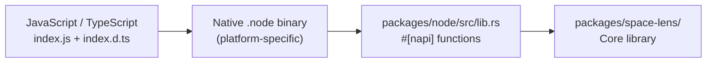

# NAPI Bindings

<cite>
**Referenced Files in This Document**
- [packages/node/src/lib.rs](file:///Users/hk/Dev/space-lens/packages/node/src/lib.rs)
- [packages/node/build.rs](file:///Users/hk/Dev/space-lens/packages/node/build.rs)
- [packages/node/index.js](file:///Users/hk/Dev/space-lens/packages/node/index.js)
- [packages/node/index.d.ts](file:///Users/hk/Dev/space-lens/packages/node/index.d.ts)
- [packages/node/package.json](file:///Users/hk/Dev/space-lens/packages/node/package.json)
- [packages/node/Cargo.toml](file:///Users/hk/Dev/space-lens/packages/node/Cargo.toml)
</cite>

## Table of Contents

1. [Role](#role)
2. [Build Process](#build-process)
3. [Exported API](#exported-api)
4. [Type Mapping](#type-mapping)
5. [Platform Binary Loading](#platform-binary-loading)

## Role

The `packages/node/` crate serves as the bridge between Rust and Node.js. It compiles as a `cdylib` (dynamic library) and uses [napi-rs](https://napi.rs) to expose the core library's functionality as native Node.js addon functions. This allows the `space-lens` npm package to offer high-performance directory scanning without users writing any Rust code.



**Section sources**

- [packages/node/Cargo.toml](file:///Users/hk/Dev/space-lens/packages/node/Cargo.toml#L10-L11)
- [packages/node/src/lib.rs](file:///Users/hk/Dev/space-lens/packages/node/src/lib.rs#L1-L13)

## Build Process

The build has two steps:

1. **Build script** (`build.rs`): Simply calls `napi_build::setup()` to configure the build environment for napi-rs.
2. **NAPI CLI** (`@napi-rs/cli`): The `napi build` command compiles the Rust crate and produces:
   - A platform-specific `.node` binary (e.g., `space-lens.darwin-arm64.node`)
   - An auto-generated `index.js` loader
   - An auto-generated `index.d.ts` TypeScript declaration

```bash
yarn workspace space-lens build:debug  # napi build --platform (debug)
yarn workspace space-lens build        # napi build --platform --release (release)
```

The `napi` config in `package.json` specifies 8 build targets across 3 OSes and 2 architectures.

**Section sources**

- [packages/node/build.rs](file:///Users/hk/Dev/space-lens/packages/node/build.rs)
- [packages/node/package.json](file:///Users/hk/Dev/space-lens/packages/node/package.json#L29-L41)
- [packages/node/package.json](file:///Users/hk/Dev/space-lens/packages/node/package.json#L52-L53)

## Exported API

All functions are defined as `#[napi]` Rust functions, which napi-rs automatically exposes to Node.js:

### Functions

| JS Name | Rust Name | Description |
|---------|-----------|-------------|
| `scanDirectory` | `scan_directory` | Scan directories and return a tree of `DirectoryNode` |
| `findCleanupCandidates` | `find_cleanup_candidates` | Find cleanup candidates by preset |
| `planCleanup` | `plan_cleanup` | Find candidates and build a removal plan (dry-run) |
| `executeCleanup` | `execute_cleanup` | Execute a removal plan (actual deletion) |

### TypeScript Interfaces (from `index.d.ts`)

```typescript
interface DirectoryScanOptions {
  directories: string[]
  ignoreHidden?: boolean
  fullPath?: boolean
  respectGitignore?: boolean
  ignoredMode?: string   // "summarize" | "exclude"
}

interface DirectoryNode {
  name: string
  path: string
  size: number
  children: DirectoryNode[]
  depth: number
  ignored: boolean
  collapsed: boolean
}

interface CleanupCandidateOptions {
  directories: string[]
  presets?: string[]     // "node" | "rust" | "gitignored"
  ignoreHidden?: boolean
}

interface RemovalPlan {
  entries: RemovalEntry[]
  totalSize: number
  errors: string[]
}

interface RemovalOutcome {
  removed: RemovalEntry[]
  bytesRemoved: number
  errors: string[]
}
```

**Section sources**

- [packages/node/src/lib.rs](file:///Users/hk/Dev/space-lens/packages/node/src/lib.rs#L54-L182)
- [packages/node/index.d.ts](file:///Users/hk/Dev/space-lens/packages/node/index.d.ts#L1-L60)

## Type Mapping

The bindings convert between Rust and JavaScript types:

| Rust Type | JS Type | Notes |
|-----------|---------|-------|
| `u64` | `i64` | Rust u64 -> i64 (clamped to i64::MAX if overflow) |
| `PathBuf` | `string` | Via `to_string_lossy()` |
| `Vec<T>` | `T[]` | Direct mapping |
| `Option<bool>` | `boolean \| undefined` | Via `Option` |
| `String` | `string` | Direct mapping |

Field names are converted from `snake_case` to `camelCase` using `#[napi(js_name = "camelCase")]` attributes.

**Section sources**

- [packages/node/src/lib.rs](file:///Users/hk/Dev/space-lens/packages/node/src/lib.rs#L16-L26)
- [packages/node/src/lib.rs](file:///Users/hk/Dev/space-lens/packages/node/src/lib.rs#L241-L252)

## Platform Binary Loading

The auto-generated `index.js` acts as a loader that:
1. Detects the current platform (OS, architecture, libc variant).
2. Determines whether the system uses musl libc (via filesystem detection, `/proc/self/maps`, or `ldd`).
3. Loads the corresponding `.node` binary from the `npm/` package directory.

This enables seamless cross-platform usage of the npm package without manual binary selection.

**Section sources**

- [packages/node/index.js](file:///Users/hk/Dev/space-lens/packages/node/index.js#L1-L30)
