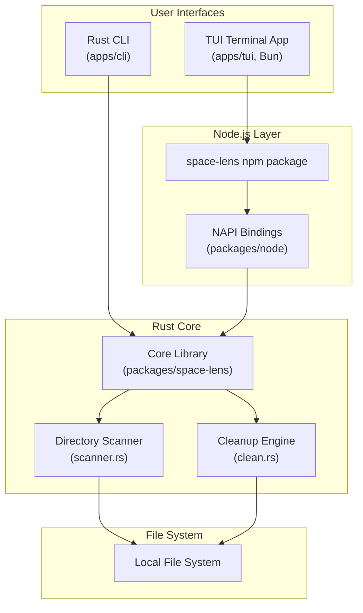

# System Overview

<cite>
**Referenced Files in This Document**
- [README.md](file:///Users/hk/Dev/space-lens/README.md)
- [Cargo.toml](file:///Users/hk/Dev/space-lens/Cargo.toml)
- [package.json](file:///Users/hk/Dev/space-lens/package.json)
- [packages/space-lens/Cargo.toml](file:///Users/hk/Dev/space-lens/packages/space-lens/Cargo.toml)
- [packages/node/Cargo.toml](file:///Users/hk/Dev/space-lens/packages/node/Cargo.toml)
- [apps/cli/Cargo.toml](file:///Users/hk/Dev/space-lens/apps/cli/Cargo.toml)
- [apps/tui/package.json](file:///Users/hk/Dev/space-lens/apps/tui/package.json)
- [packages/node/package.json](file:///Users/hk/Dev/space-lens/packages/node/package.json)
</cite>

## Table of Contents

1. [Purpose](#purpose)
2. [Architecture Overview](#architecture-overview)
3. [Workspace Structure](#workspace-structure)
4. [Technology Choices](#technology-choices)
5. [Key Design Decisions](#key-design-decisions)

## Purpose

Space Lens is a fast disk usage scanner and cleanup candidate finder. It recursively scans directories, reports file sizes (accounting for hard links and block allocation), identifies cleanup candidates by preset rules (Node.js `node_modules`, Rust `target/`, gitignored paths), and optionally deletes them. The project is structured as a dual-language monorepo: a high-performance Rust core library wrapped in NAPI-RS bindings for JavaScript/TypeScript consumption, along with both a Rust CLI and a TypeScript TUI (terminal UI).

**Section sources**

- [README.md](file:///Users/hk/Dev/space-lens/README.md#L1-L135)

## Architecture Overview

Two primary access paths exist:

1. **Rust CLI** (`apps/cli`): A clap-based CLI that links directly to the core library as a Cargo workspace dependency. Offers `scan`, `candidates`, and `clean` subcommands.
2. **TypeScript TUI** (`apps/tui`): A terminal UI built with Effect and OpenTUI that consumes the `space-lens` npm package. Requires Bun at runtime for OpenTUI's native FFI.

**Diagram sources**

- [README.md](file:///Users/hk/Dev/space-lens/README.md#L82-L94)

## Workspace Structure

The project uses two independent workspace systems:

**Cargo Workspace** (resolver 2) — 3 crates:
| Crate | Path | Role |
|-------|------|------|
| `space-lens` | `packages/space-lens/` | Core library (scanner + cleanup) |
| `space-lens-node` | `packages/node/` | NAPI-RS binding (cdylib) |
| `space-lens-cli` | `apps/cli/` | Rust binary CLI |

**Yarn Workspace** (v4, `nodeLinker: node-modules`) — 2 packages:
| Package | Path | Published as | Role |
|---------|------|-------------|------|
| `space-lens` | `packages/node/` | `space-lens` | npm package with native bindings |
| `@space-lens/cli` | `apps/tui/` | `@space-lens/cli` | TUI terminal app |

**Section sources**

- [Cargo.toml](file:///Users/hk/Dev/space-lens/Cargo.toml#L1-L14)
- [package.json](file:///Users/hk/Dev/space-lens/package.json#L1-L42)
- [packages/node/package.json](file:///Users/hk/Dev/space-lens/packages/node/package.json#L1-L117)
- [apps/tui/package.json](file:///Users/hk/Dev/space-lens/apps/tui/package.json#L1-L54)

## Technology Choices

| Technology | Used In | Rationale |
|------------|---------|-----------|
| Rust | Core library, bindings, CLI | Performance-critical file system traversal; safe parallelism |
| napi-rs | NAPI bindings | Zero-copy FFI between Rust and Node.js; auto-generates TypeScript types |
| ignore crate | Core scanner | Gitignore pattern matching; used by ripgrep |
| rayon | Core scanner | Parallel directory traversal with work-stealing |
| clap | Rust CLI | De-facto standard Rust argument parser with derive macros |
| Effect | TUI | Type-safe, composable effect system for CLI argument parsing and error handling |
| OpenTUI | TUI | Terminal UI framework; uses Bun-native FFI for rendering |
| tsdown | TUI bundler | Fast ESM bundler for the TUI distribution |
| oxlint | Node linting | Fast Rust-based linter; replaces eslint |
| Yarn 4 | JS monorepo | Modern package manager with `nodeLinker: node-modules` |

**Section sources**

- [packages/space-lens/Cargo.toml](file:///Users/hk/Dev/space-lens/packages/space-lens/Cargo.toml#L10-L17)
- [packages/node/Cargo.toml](file:///Users/hk/Dev/space-lens/packages/node/Cargo.toml#L13-L19)
- [packages/node/package.json](file:///Users/hk/Dev/space-lens/packages/node/package.json#L65-L83)
- [apps/tui/package.json](file:///Users/hk/Dev/space-lens/apps/tui/package.json#L36-L53)

## Key Design Decisions

1. **Rust core, JavaScript surface**: Performance-critical file scanning is in Rust; higher-level interfaces (TUI, programmatic API) are in TypeScript.
2. **Dry-run by default**: Neither the Rust CLI nor the JS API deletes files without explicit opt-in (`--execute` flag, or `executeCleanup()` call).
3. **Hard link deduplication**: The scanner tracks inode pairs `(device, inode)` across platforms to avoid double-counting hard-linked files.
4. **Collapsible ignored subtrees**: With `ignored_mode: "summarize"`, gitignored directories (e.g. `node_modules`, `target/`) are shown as leaf nodes with total size rather than expanded.
5. **Bun requirement for TUI**: OpenTUI 0.4.x uses native FFI that only Bun supports — the TUI cannot run under Node.js.

**Section sources**

- [packages/space-lens/src/scanner.rs](file:///Users/hk/Dev/space-lens/packages/space-lens/src/scanner.rs#L39-L47)
- [packages/space-lens/src/scanner.rs](file:///Users/hk/Dev/space-lens/packages/space-lens/src/scanner.rs#L233-L246)
- [apps/tui/src/runtime.ts](file:///Users/hk/Dev/space-lens/apps/tui/src/runtime.ts#L1-L13)
- [README.md](file:///Users/hk/Dev/space-lens/README.md#L59-L82)
