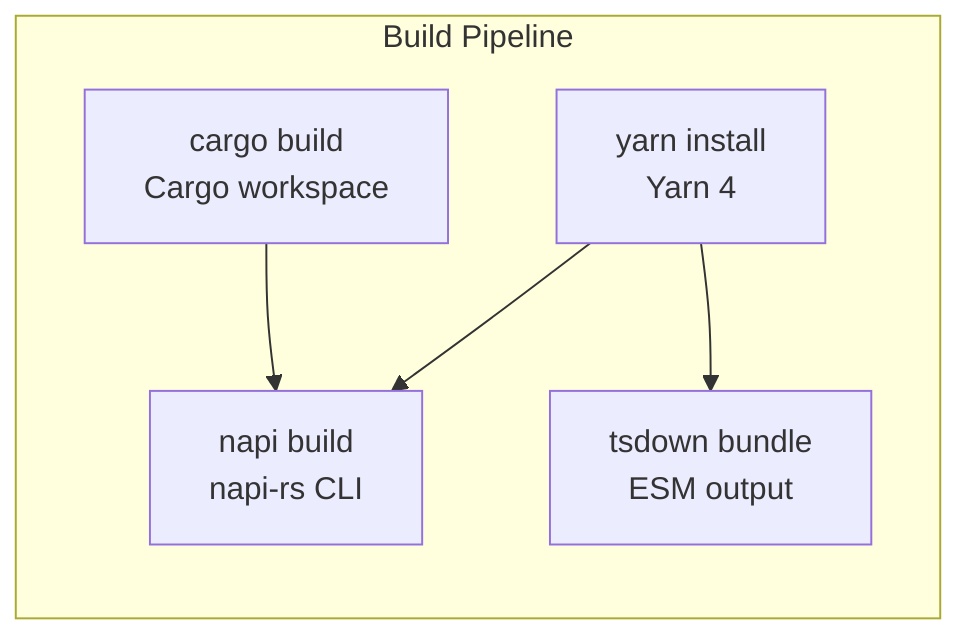

# Technology Stack

<cite>
**Referenced Files in This Document**
- [Cargo.toml](file:///Users/hk/Dev/space-lens/Cargo.toml)
- [package.json](file:///Users/hk/Dev/space-lens/package.json)
- [packages/space-lens/Cargo.toml](file:///Users/hk/Dev/space-lens/packages/space-lens/Cargo.toml)
- [packages/node/Cargo.toml](file:///Users/hk/Dev/space-lens/packages/node/Cargo.toml)
- [apps/cli/Cargo.toml](file:///Users/hk/Dev/space-lens/apps/cli/Cargo.toml)
- [packages/node/package.json](file:///Users/hk/Dev/space-lens/packages/node/package.json)
- [apps/tui/package.json](file:///Users/hk/Dev/space-lens/apps/tui/package.json)
- [packages/node/build.rs](file:///Users/hk/Dev/space-lens/packages/node/build.rs)
- [apps/tui/tsdown.config.ts](file:///Users/hk/Dev/space-lens/apps/tui/tsdown.config.ts)
- [apps/tui/tsconfig.json](file:///Users/hk/Dev/space-lens/apps/tui/tsconfig.json)
- [packages/node/tsconfig.json](file:///Users/hk/Dev/space-lens/packages/node/tsconfig.json)
</cite>

## Table of Contents

1. [Languages](#languages)
2. [Rust Ecosystem](#rust-ecosystem)
3. [TypeScript / Node.js Ecosystem](#typescript--nodejs-ecosystem)
4. [Build Tooling](#build-tooling)
5. [Why These Choices](#why-these-choices)

## Languages

| Language | Usage | Version |
|----------|-------|---------|
| Rust | Core library, NAPI bindings, CLI binary | Edition 2021 |
| TypeScript | TUI application, package type definitions | 6.x (packages/node), 6.x (apps/tui) |
| JavaScript | NAPI loader script (index.js) | ES2023 target |

## Rust Ecosystem

### Core Dependencies (`packages/space-lens/`)

| Crate | Version | Purpose |
|-------|---------|---------|
| `ignore` | 0.4 | Gitignore pattern matching (same crate used by ripgrep) |
| `rayon` | 1 | Parallel directory traversal via work-stealing iterator |
| `serde` | 1 (with `derive`) | Serialization for JSON output and data structures |
| `windows-sys` | 0.61 | Windows-specific inode detection via `GetFileInformationByHandle` |

### NAPI Bindings (`packages/node/`)

| Crate | Version | Purpose |
|-------|---------|---------|
| `napi` | 3.0.0 | NAPI-RS runtime — FFI bridge from Rust to Node.js |
| `napi-derive` | 3.0.0 | Procedural macros for `#[napi]` attribute exports |
| `napi-build` | 2.0.0 (build-dep) | Build script helper for NAPI |

### Rust CLI (`apps/cli/`)

| Crate | Version | Purpose |
|-------|---------|---------|
| `clap` | 4 (with `derive`) | CLI argument parsing |
| `anyhow` | 1 | Error handling with context |
| `serde_json` | 1 | JSON output formatting |

**Section sources**

- [packages/space-lens/Cargo.toml](file:///Users/hk/Dev/space-lens/packages/space-lens/Cargo.toml#L10-L17)
- [packages/node/Cargo.toml](file:///Users/hk/Dev/space-lens/packages/node/Cargo.toml#L13-L19)
- [apps/cli/Cargo.toml](file:///Users/hk/Dev/space-lens/apps/cli/Cargo.toml#L14-L19)

## TypeScript / Node.js Ecosystem

### NAPI Package (`packages/node/`)

| Package | Version | Purpose |
|---------|---------|---------|
| `@napi-rs/cli` | ^3.2.0 | NAPI build tooling |
| `@oxc-node/core` | ^0.1.0 | TypeScript transpilation for AVA tests (via `--import` flag) |
| `ava` | ^8.0.0 | Test framework (formerly ava) |
| `oxlint` | ^1.14.0 | Rust-based linter |
| `tinybench` | ^6.0.0 | Benchmark framework for `cli.ts` bench script |
| `chalk` | ^5.6.2 | Terminal colors for bench script |
| `citty` | ^0.2.2 | CLI framework for bench script |

### TUI Package (`apps/tui/`)

| Package | Version | Purpose |
|---------|---------|---------|
| `effect` | ^3.21.3 | Type-safe effect system (core) |
| `@effect/cli` | ^0.75.2 | CLI argument parsing with Effect |
| `@effect/platform` | ^0.96.1 | Platform abstractions (filesystem, etc.) |
| `@effect/platform-node` | ^0.107.0 | Node.js platform provider |
| `@effect/printer` | ^0.49.0 | Document-based formatting |
| `@effect/printer-ansi` | ^0.49.0 | ANSI terminal formatting |
| `@opentui/core` | ^0.4.1 | Terminal UI framework (Bun-only FFI) |
| `space-lens` | ^0.2.0 | Native scanning and cleanup bindings |
| `tsdown` | ^0.22.2 | ESM bundler (bundled build) |
| `tsx` | ^4.22.4 | TypeScript executor for tests |

**Section sources**

- [packages/node/package.json](file:///Users/hk/Dev/space-lens/packages/node/package.json#L65-L83)
- [apps/tui/package.json](file:///Users/hk/Dev/space-lens/apps/tui/package.json#L36-L53)

## Build Tooling

| Tool | Config | Purpose |
|------|--------|---------|
| Yarn 4 | `.yarnrc.yml` (`nodeLinker: node-modules`) | JS monorepo management |
| napi-rs CLI | `packages/node/package.json` (`"napi"` key) | NAPI build targets |
| tsdown | `apps/tui/tsdown.config.ts` | TUI bundling (ESM, dts generation) |
| cargo | `Cargo.toml` (workspace) | Rust compilation |
| taplo | `.taplo.toml` | TOML formatting |
| prettier | `package.json` (prettier config) | Code formatting |
| Husky | `.husky/pre-commit` | Git pre-commit hooks |

**Section sources**

- [.yarnrc.yml](file:///Users/hk/Dev/space-lens/.yarnrc.yml#L1)
- [apps/tui/tsdown.config.ts](file:///Users/hk/Dev/space-lens/apps/tui/tsdown.config.ts#L1-L12)
- [.taplo.toml](file:///Users/hk/Dev/space-lens/.taplo.toml#L1-L7)

## Why These Choices

- **Rust over C/C++ for native module**: Safer memory model, `ignore` crate eliminates manual gitignore parsing, `rayon` provides safe parallel iteration.
- **napi-rs over node-gyp**: Automatic TypeScript type generation, cross-compilation support, no need for `.gyp` files.
- **Effect over commander/yargs**: Type-safe CLI parsing with compile-time guarantees, composable error handling, resource-safe platform providers.
- **OpenTUI over blessed/react-blessed**: Modern Rust-backed terminal rendering via Bun FFI, simpler component model.
- **oxlint over eslint**: ~50x faster linting, zero configuration needed, native Rust binary.
- **tsdown over tsup/esbuild**: Lighter-weight alternative tuned for library bundling with ESM-first output.
- **ava over vitest/jest**: Faster test execution for native module testing, simpler configuration.

**Section sources**

- [packages/space-lens/Cargo.toml](file:///Users/hk/Dev/space-lens/packages/space-lens/Cargo.toml#L10-L17)
- [apps/tui/package.json](file:///Users/hk/Dev/space-lens/apps/tui/package.json#L36-L53)
