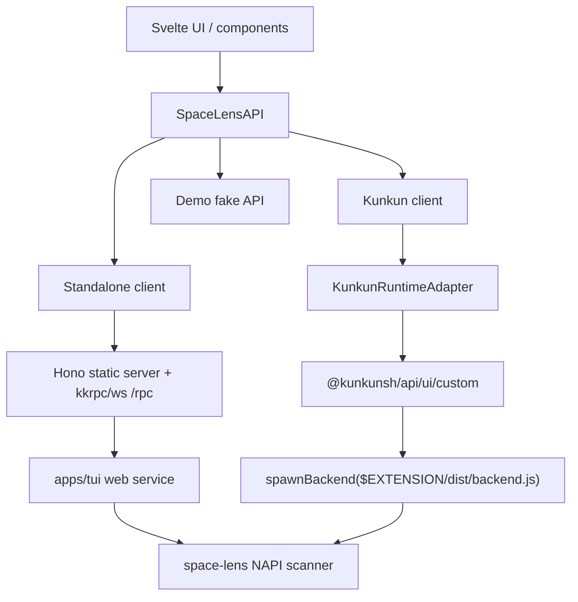
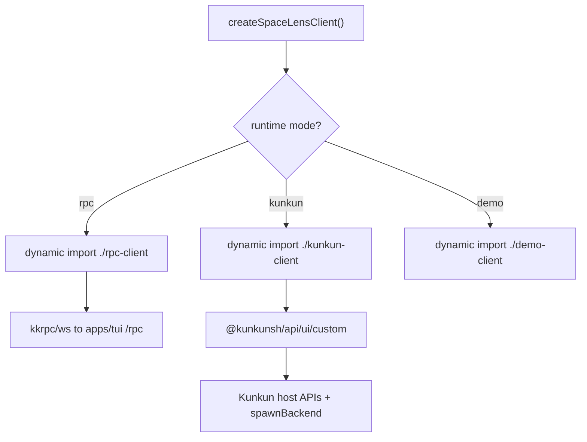
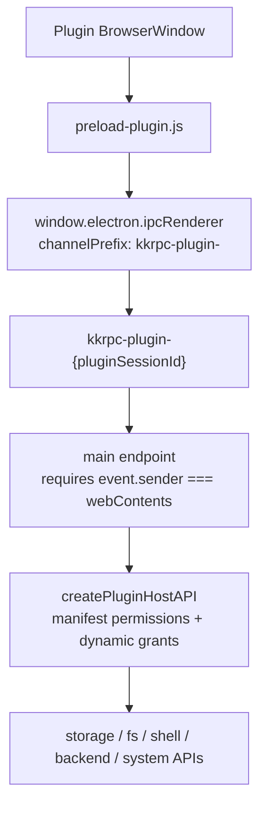

# Space Lens

Fast directory scanning and cleanup candidate utilities, powered by Rust and napi-rs.

## Installation

```bash
npm install space-lens
```

## API Usage

```ts
import { scanDirectory } from 'space-lens'

const tree = scanDirectory({
  directories: [process.cwd()],
  ignoreHidden: false,
  fullPath: false,
  respectGitignore: true,
  ignoredMode: 'summarize',
})

console.dir(tree, { depth: 3 })
```

Find cleanup candidates without deleting anything:

```ts
import { findCleanupCandidates, planCleanup } from 'space-lens'

const candidates = findCleanupCandidates({
  directories: [process.cwd()],
  presets: ['node', 'rust', 'gitignored'],
})

const plan = planCleanup({
  directories: [process.cwd()],
  presets: ['node'],
})
```

## Directory Scanning

`scanDirectory` is intended for large folders where keeping every file node in memory is too expensive.
With `ignoredMode: 'summarize'`, ignored directories such as `target/` or `node_modules/` are scanned for total size but returned as collapsed leaf nodes:

```ts
{
  name: 'target',
  path: '/path/to/project/target',
  size: 1238249472,
  children: [],
  ignored: true,
  collapsed: true
}
```

Use `ignoredMode: 'exclude'` to skip ignored paths entirely.

## Cleanup Candidates

Cleanup APIs are dry-run oriented. `findCleanupCandidates` reports matching paths and sizes, and `planCleanup` returns a removal plan. The npm package does not execute deletion.

Initial presets:

- `node`: reports `node_modules`.
- `rust`: reports Cargo `target` directories.
- `gitignored`: reports paths matched by `.gitignore`.

## Rust CLI

The workspace includes a simple Rust CLI app:

```bash
cargo run -p space-lens-cli -- scan ~/Dev --json
cargo run -p space-lens-cli -- candidates ~/Dev --preset node
cargo run -p space-lens-cli -- clean ~/Dev --preset node
```

`clean` defaults to dry-run. Add `--execute` only when you want to remove the planned paths.

## spacelens TUI CLI

The workspace also includes `spacelens`, an OpenTUI app with two modes: `scan` for a disk usage tree and `clean` for selecting cleanup candidates and deleting them after confirmation. OpenTUI 0.4.x uses native FFI that currently needs Bun at runtime:

```bash
pnpm tui ~/Dev --preset rust
pnpm tui ~/Dev --preset node,gitignored --sort path
npx @space-lens/cli ~/Dev --preset rust
```

Inside the TUI, press `tab` to switch modes, `space` to select a cleanup candidate, `x` to request deletion, and `enter` to confirm. Use `Ctrl+C` or `q` to quit.

## Web UI and Kunkun Plugin Modes

Space Lens also has a Svelte web UI in `apps/web`. The web UI is deliberately written against one application contract, `SpaceLensAPI`, so the same UI can run in more than one host:

- standalone NPX/browser mode: `apps/tui` serves static web assets with Hono and exposes `SpaceLensAPI` over authenticated `kkrpc/ws` at `/rpc`.
- Kunkun plugin mode: `apps/kunkun-plugin` hosts the same web UI as a Kunkun custom view and starts the backend through Kunkun's `spawnBackend()` API.
- demo mode: the web app can use an in-memory fake API for UI-only development.

In this document, "standalone mode" means Space Lens is running outside Kunkun: a user starts `spacelens-web`, opens the printed local browser URL, and the browser talks to the local Space Lens process over WebSocket kkrpc. It is the NPX/browser host for Space Lens, not a Kunkun plugin.

This is an advanced dual-host pattern rather than the simplest recommended Kunkun plugin demo. A normal Kunkun-only plugin can import `@kunkunsh/api/ui/custom` directly from its view. Space Lens uses an extra adapter layer because the same web app must also work as a standalone browser app without taking Kunkun packages as normal dependencies. The web package declares `@kunkunsh/api` as an optional peer for Kunkun mode, and the Kunkun plugin build links the local Kunkun checkout to satisfy that peer.



The important boundary is that UI/components depend on `SpaceLensAPI`, not on Hono, Electron, Kunkun IPC, Node filesystem APIs, or the scanner binding.

### Standalone Browser Mode

The published CLI owns the standalone browser host:

```bash
npm exec --package=@space-lens/cli -- spacelens-web
```

For local development:

```bash
pnpm --filter web build
pnpm --filter @space-lens/cli dev:web
```

The server binds to loopback by default, prints a browser URL, and includes a high-entropy boot token in the generated app/RPC URLs. Browser localhost access should be treated as hostile; do not expose scan or cleanup APIs through unauthenticated localhost routes.

### Kunkun Plugin Mode

Kunkun mode lives in `apps/kunkun-plugin`. Start the plugin web dev server from the Kunkun workspace with:

```bash
pnpm --filter @space-lens/kunkun-plugin dev
```

Build the plugin with:

```bash
pnpm --filter @space-lens/kunkun-plugin build
```

The web app chooses its transport at runtime. `createSpaceLensClient()` is async and dynamically imports only the client needed for the current mode:



`@kunkunsh/api/ui/custom` still auto-connects to the Kunkun custom-view host when imported, but Space Lens imports it only from `kunkun-client.ts` and only after runtime mode resolves to `kunkun`. Standalone browser mode therefore loads `rpc-client.ts` and never initializes the Kunkun custom-view channel.

Runtime mode detection is intentionally explicit. Space Lens enters Kunkun mode when one of these host signals is present:

- `?spaceLensMode=kunkun`, mainly for plugin dev server workflows.
- `window.__kunkun__.kind === "custom-view"`, injected by Kunkun's plugin preload for Electron custom-view windows.
- a `/custom-views/:pluginId/:commandName` route, used by custom-view hosts that identify plugin views through the URL path.

Space Lens does not use raw `window.electron.ipcRenderer` presence as a Kunkun-mode signal. IPC availability is a transport detail, not an authorization signal and not a security boundary.

In Electron custom-view windows, Kunkun exposes a limited bridge to the plugin window so `@kunkunsh/api/ui/custom` can connect back to the host. That bridge is still treated as untrusted plugin input:



This means a plugin can use its own Kunkun host channel, but it should not be able to call the main app renderer channel or another plugin/backend channel by guessing names. Privileged operations must still be enforced by the host API implementation: storage requires `storage`, scans request scoped `fs-read`, deletion requires confirmation plus scoped `fs-write`, and backend process spawning is mediated by Kunkun permissions and runtime policy.

`kunkun-client.ts` still uses a small internal `KunkunRuntimeAdapter` interface for testability and separation of concerns. The default adapter is built with lazy imports from `@kunkunsh/api/ui/custom` and `@kunkunsh/api`; tests can inject a fake adapter without constructing Kunkun RPC channels.

Kunkun mode still uses the same `SpaceLensAPI` as standalone mode. The difference is transport ownership:

- standalone owns transport in `apps/tui`: Hono + `kkrpc/ws`;
- Kunkun owns transport in `@kunkunsh/api/ui/custom`: custom-view host connection + `spawnBackend()`;
- `apps/web` owns only UI behavior and Space Lens client composition.

## Benchmark CLI

This repository includes a local CLI for benchmarking the directory scanner and exporting trees:

```bash
pnpm bench ~/Dev
pnpm bench ~/Dev --no-json-size
pnpm bench ~/Dev --export-tree tree.json
```

Options:

```text
--export-tree PATH
--json-size / --no-json-size
--ignore-hidden
--full-path
--respect-gitignore / --no-respect-gitignore
--ignored-mode summarize|exclude
```

## Development

```bash
pnpm install
pnpm --filter space-lens build:debug
pnpm --filter @space-lens/cli build
pnpm --filter space-lens test
pnpm --filter @space-lens/cli test
pnpm --filter space-lens typecheck
cargo test --workspace
```

Useful local commands:

- `pnpm build`: build release bindings for the current platform.
- `pnpm build:debug`: build debug bindings for local testing.
- `pnpm tui`: run the Bun/OpenTUI cleanup candidate viewer.
- `pnpm test`: run Rust workspace tests and AVA tests.
- `pnpm typecheck`: type-check the TypeScript workspaces.
- `pnpm bench`: run the benchmark CLI from the `space-lens` npm workspace.
